# SW Migration Engine - Architecture

This document provides a deep technical description of the internal architecture of the Schema Weaver Migration Engine.

## Overall Architecture

The engine follows a layered pipeline architecture where data flows through distinct processing stages:

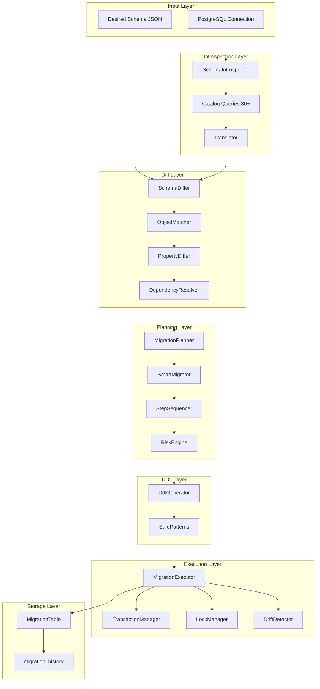

## Internal Component Diagram

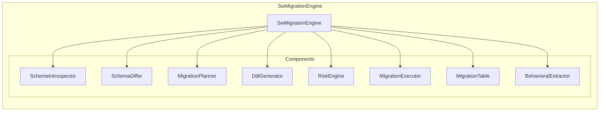

## Data Flow

### Input Types
- **Desired Schema:** JSON representation of target schema state
- **Connection Pool:** `pg.Pool` instance for database access
- **Options:** Configuration for timeouts, risk thresholds, dry-run mode

### Output Types
- **SchemaSnapshot:** Complete introspected state (`types/schema.js`)
- **SchemaDiff:** Change set with dependency graph (`types/changes.js`)
- **MigrationPlan:** Ordered execution steps (`types/migration.js`)
- **MigrationResult:** Execution outcome with timing, errors, intents

### Flow Sequence

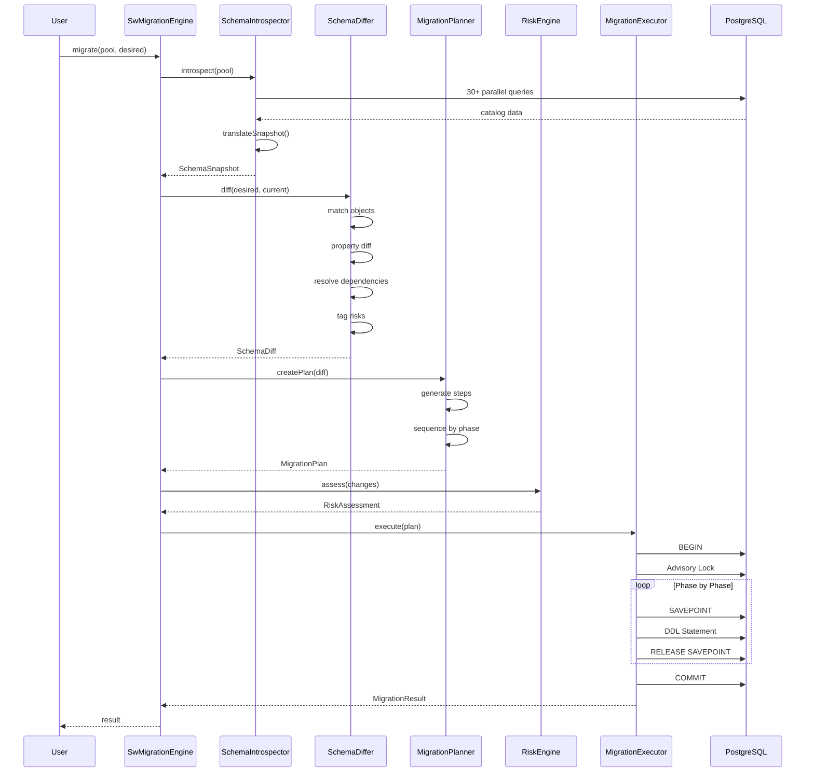

## Complete Migration Lifecycle

### Phase 1: Introspection

The introspector queries the PostgreSQL system catalogs to produce a complete snapshot.

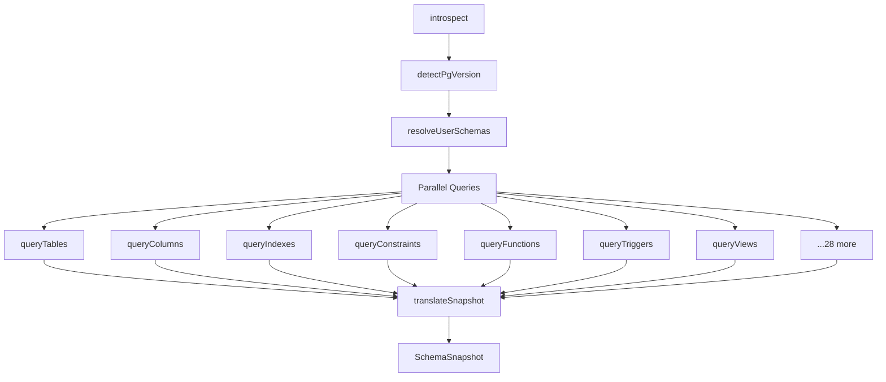

**Query Execution:**
- Uses `Promise.all()` for 30+ concurrent queries
- Each query filters by target schemas
- Error handling with fallback to empty arrays
- Version-specific queries enabled based on detected version

**Translation:**
- Raw catalog rows → normalized objects
- Type normalization (e.g., `character varying` → `varchar`)
- Default values parsed and preserved
- ACL strings parsed to privilege objects

### Phase 2: Diff

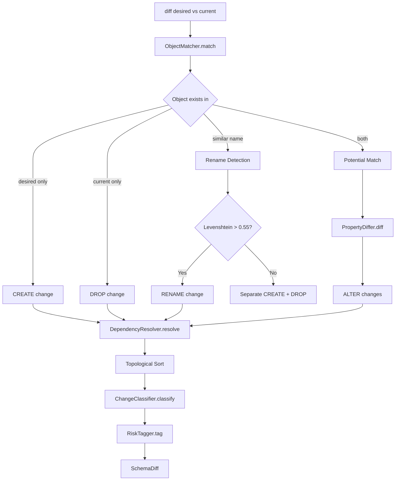

**Object Matching Algorithm:**
```
for each object in desired:
    if object exists in current (same key):
        mark as MATCH (needs property diff)
    else:
        mark as CREATE
        
for each object in current:
    if object not in desired:
        mark as potential DROP
        
for each potential DROP:
    for each potential CREATE:
        similarity = levenshtein_similarity(DROP.name, CREATE.name)
        if similarity > 0.55:
            mark as potential RENAME
            if user confirms:
                convert DROP+CREATE to RENAME
```

**Property Diffing:**
- Deep comparison of all properties
- Type-aware comparison (e.g., arrays, objects)
- Handles default value normalization
- Constraint clause decomposition

### Phase 3: Planning

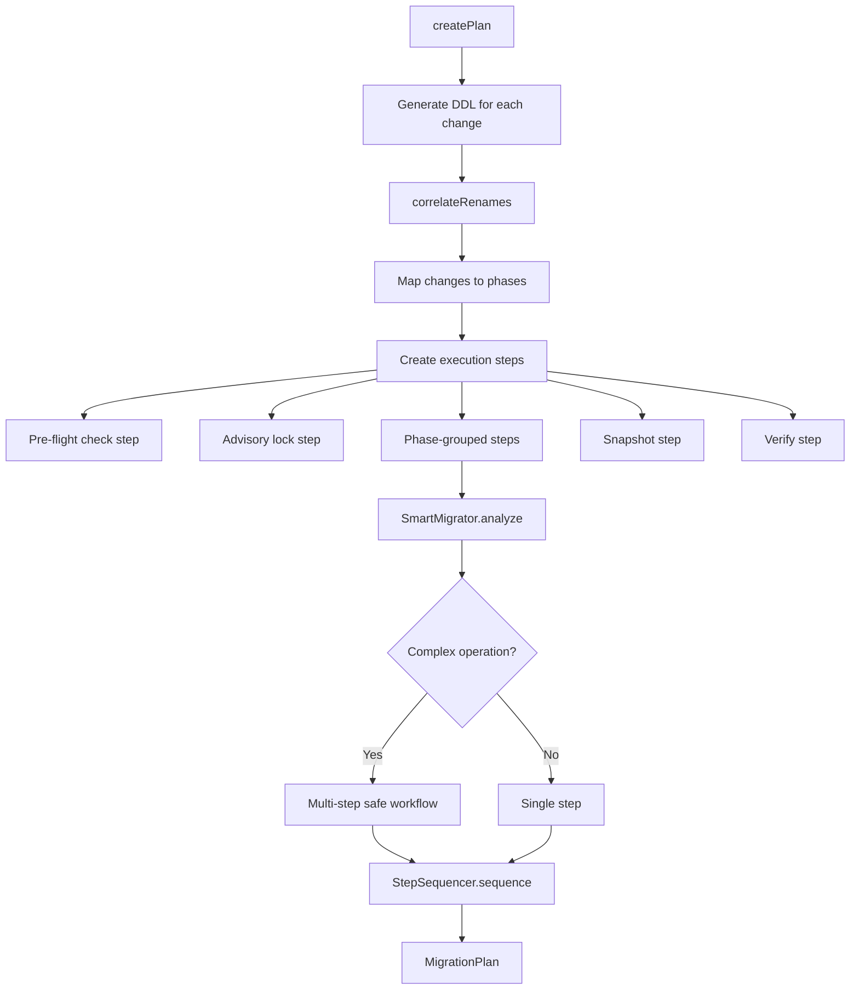

**Phase Mapping Logic:**

| Change Type | Object Type | Phase |
|-------------|-------------|-------|
| CREATE | extension | 3 |
| CREATE | schema | 5 |
| CREATE | type, domain | 4 |
| CREATE | sequence | 5 |
| CREATE | table | 6 |
| CREATE | column | 7 |
| CREATE | index (blocking) | 9 |
| CREATE | index (concurrent) | 23 |
| CREATE | constraint (non-FK) | 10 |
| CREATE | constraint (FK) | 12 |
| CREATE | view | 14 |
| CREATE | materializedView | 15 |
| CREATE | function, procedure | 16 |
| CREATE | trigger | 17 |
| CREATE | policy | 18 |
| CREATE | rule | 19 |
| ALTER | column | 11 |
| ALTER | constraint | 12 |
| ALTER | sequence | 8 |
| DROP | behavioral objects | 27 |
| DROP | constraints | 28 |
| DROP | indexes | 29 |
| DROP | columns | 30 |
| DROP | sequences | 31 |
| DROP | structural objects | 32 |

### Phase 4: Execution

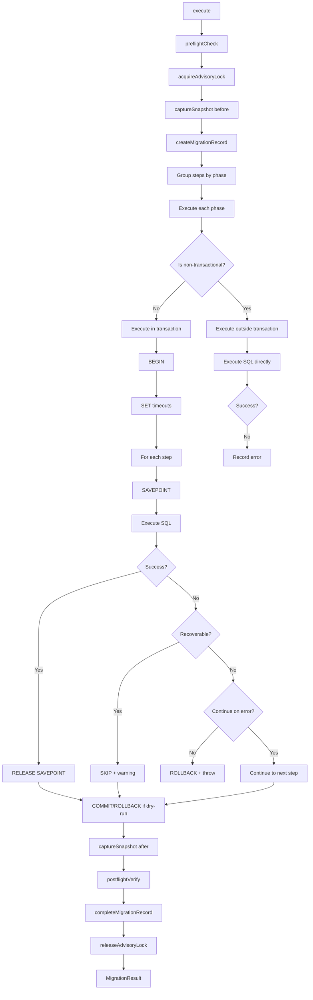

## Planner Internals

### SmartMigrator Analysis

The SmartMigrator detects operations that require multi-step safe patterns:

```javascript
analyze(change) {
  // NOT NULL addition on non-empty table
  if (change.property === 'isNullable' && change.after === false) {
    return [
      { sql: 'ADD CONSTRAINT chk CHECK (col IS NOT NULL) NOT VALID' },
      { sql: 'VALIDATE CONSTRAINT chk' },
      { sql: 'ALTER COLUMN SET NOT NULL' },
      { sql: 'DROP CONSTRAINT chk' }
    ];
  }
  
  // Type cast with potential data loss
  if (change.property === 'dataType' && isUnsafeCast(change.before, change.after)) {
    return [
      { sql: 'ADD COLUMN col_new target_type' },
      { sql: 'UPDATE table SET col_new = CAST(col AS target)' },
      { sql: 'DROP COLUMN col' },
      { sql: 'RENAME COLUMN col_new TO col' }
    ];
  }
  
  // ... more patterns
}
```

### Dependency Resolution (Topological Sort)

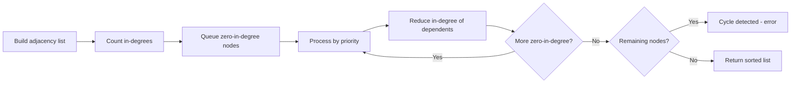

**Priority Order for Same-Level Objects:**
1. Schema
2. Extension
3. Type
4. Table
5. Column
6. Constraint
7. Index
8. Sequence
9. Function
10. View
11. Trigger
12. Policy
13. Rule

## Differ Internals

### Rename Detection

Uses Levenshtein distance for fuzzy matching:

```javascript
function similarity(a, b) {
  const dist = levenshtein(a, b);
  const maxLen = Math.max(a.length, b.length);
  return 1 - (dist / maxLen);
}

// Confidence thresholds:
// HIGH:    > 0.80  (auto-confirm with same type family + parent)
// MEDIUM:  0.55-0.80 (require user confirmation)
// LOW:     0.35-0.55 (treat as separate CREATE + DROP)
```

**Match Scoring:**
```
score = levenshtein_similarity(old, new)
score += 0.25 if same_type_family
score += 0.15 if same_parent
score += 0.25 if is_prefix_or_suffix_rename
score += 0.10 if common_words_overlap
```

### Property Differ

Handles deep comparison with type awareness:

```javascript
diff(matchedObjects) {
  const changes = [];
  for (const match of matchedObjects) {
    const before = match.current;
    const after = match.desired;
    
    for (const [key, propDef] of objectProperties) {
      const oldValue = before[key];
      const newValue = after[key];
      
      if (!isEqual(oldValue, newValue)) {
        changes.push({
          objectType: match.objectType,
          objectKey: match.key,
          property: key,
          currentValue: oldValue,
          desiredValue: newValue,
          changeType: 'ALTER',
        });
      }
    }
  }
  return changes;
}
```

## Introspection Pipeline

### Query Execution Strategy

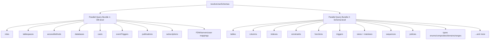

### Translation Pipeline

Raw PostgreSQL catalog rows are translated through a series of normalizers:

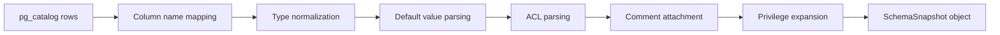

## DDL Generation Pipeline

### Statement Generation Flow

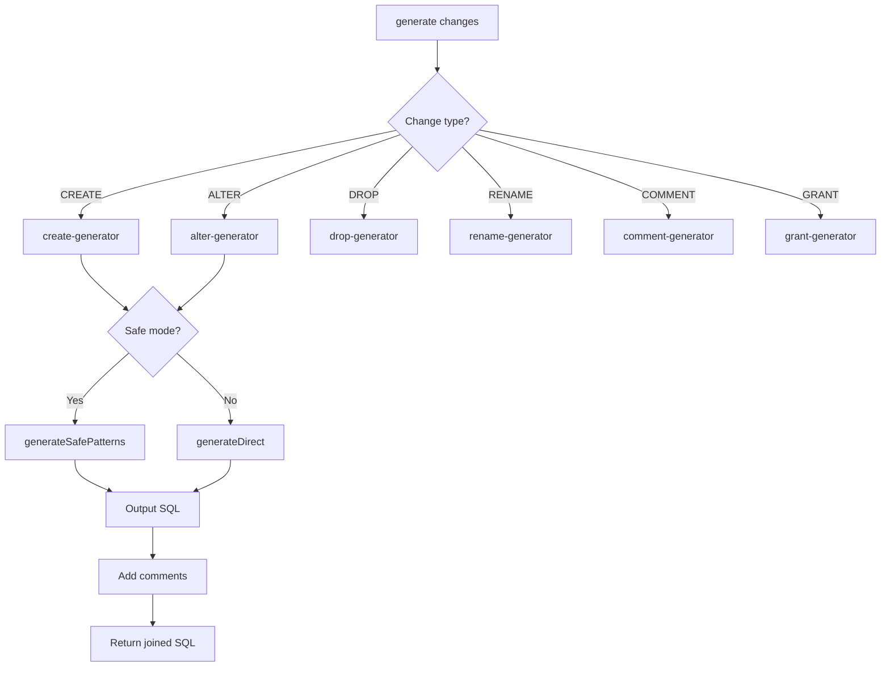

### Safe Patterns

```javascript
// SET NOT NULL (safe 3-step pattern)
function setNotNull(change) {
  const col = change.columnName;
  const tbl = change.tableName;
  const checkName = `sw_nn_check_${col}`;
  
  return [
    { sql: `ALTER TABLE ${tbl} ADD CONSTRAINT ${checkName} CHECK (${col} IS NOT NULL) NOT VALID` },
    { sql: `ALTER TABLE ${tbl} VALIDATE CONSTRAINT ${checkName}` },
    { sql: `ALTER TABLE ${tbl} ALTER COLUMN ${col} SET NOT NULL` },
    { sql: `ALTER TABLE ${tbl} DROP CONSTRAINT ${checkName}` },
  ];
}

// Foreign Key (safe pattern)
function addForeignKey(change) {
  return [
    { sql: `ALTER TABLE ${tbl} ADD CONSTRAINT ${fk} FOREIGN KEY ... NOT VALID` },
    { sql: `ALTER TABLE ${tbl} VALIDATE CONSTRAINT ${fk}` },
  ];
}

// Type Cast (safe pattern for impossible casts)
function unsafeTypeCast(change) {
  return [
    { sql: `ALTER TABLE ${tbl} ADD COLUMN ${col}_new ${newType}` },
    { sql: `UPDATE ${tbl} SET ${col}_new = CAST(${col} AS ${newType})` },
    { sql: `ALTER TABLE ${tbl} DROP COLUMN ${col}` },
    { sql: `ALTER TABLE ${tbl} RENAME COLUMN ${col}_new TO ${col}` },
  ];
}
```

## Transaction Model

### Transaction Boundaries

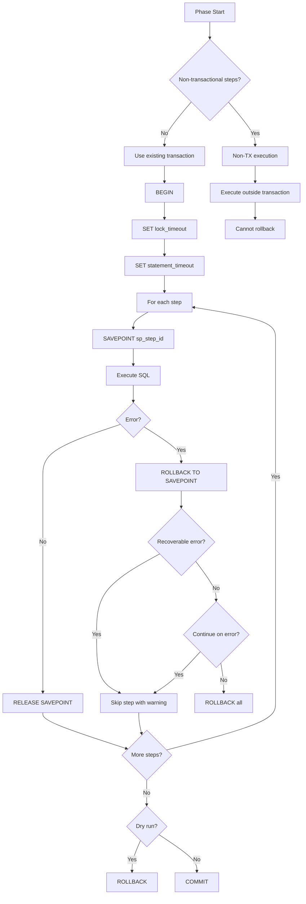

### Savepoint Naming

Savepoint names are sanitized to be valid PostgreSQL identifiers:

```javascript
function sanitizeSavepointName(stepId) {
  return stepId
    .replace(/[^a-zA-Z0-9_]/g, '_')
    .replace(/^[0-9]/, '_$&')
    .toLowerCase();
}
```

## Locking Model

### Advisory Lock Strategy

```mermaid
graph TD
    A[computeLockKey] --> B[SHA-256 hash of connectionId]
    B --> C[Convert to bigint]
    C --> D[Use as advisory lock key]
    
    D --> E[pg_try_advisory_xact_lock key]
    E --> F{Lock acquired?}
    F -->|Yes| G[Proceed with migration]
    F -->|No| HThrow MigrationConflictError]
    
    G --> I[Start heartbeat timer]
    I --> J[Periodic lock check]
    J --> K{Lock still held?}
    K -->|Yes| J
    K -->|No| L[Warning: lock lost]
```

### Lock Key Computation

```javascript
computeLockKey(connectionId) {
  const hash = crypto
    .createHash('sha256')
    .update(connectionId.toString())
    .digest('hex');
  // Convert first 8 bytes to bigint for pg_advisory_lock
  return BigInt('0x' + hash.slice(0, 16));
}
```

## Drift Detection

### Pre/Post Snapshot Comparison

```mermaid
graph TD
    A[Before Migration] --> B[Capture checksums]
    B --> C[SELECT oid, schema, name, kind, md5...]
    
    D[After Migration] --> E[Capture checksums]
    E --> F[Same query]
    
    G[Drift Detection] --> H[Compare checksums]
    H --> I{Checksums match?}
    I -->|Yes| J[No drift]
    I -->|No| K[Report drift objects]
    
    K --> L[Filter out migration changes]
    L --> M{Unexpected changes?}
    M -->|Yes| NThrow DriftDetectedError]
    M -->|No| J
```

### Drift Check Query

```sql
SELECT
  c.oid,
  n.nspname as schema,
  c.relname as name,
  c.relkind as kind,
  md5(n.nspname || '.' || c.relname || '.' || c.relkind) as checksum
FROM pg_class c
JOIN pg_namespace n ON n.oid = c.relnamespace
WHERE n.nspname NOT IN ('pg_catalog', 'information_schema', 'pg_toast')
ORDER BY n.nspname, c.relname
```

## Rollback Generation

### Strategy

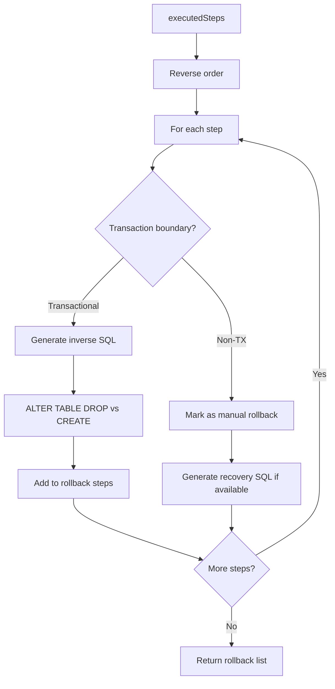

### Rollback SQL Patterns

| Forward Operation | Rollback Operation |
|-------------------|-------------------|
| CREATE TABLE | DROP TABLE |
| ADD COLUMN | DROP COLUMN |
| DROP COLUMN | Cannot rollback |
| ADD CONSTRAINT | DROP CONSTRAINT |
| CREATE INDEX | DROP INDEX |
| SET NOT NULL | DROP NOT NULL |
| ALTER TYPE | Re-ALTER TYPE (if reversible) |
| CREATE INDEX CONCURRENTLY | DROP INDEX |

## Storage Subsystem

### Migration Table Schema

```sql
CREATE TABLE migration_history (
  id UUID PRIMARY KEY DEFAULT gen_random_uuid(),
  connection_id UUID,
  version VARCHAR(30) NOT NULL,          -- YYYYMMDDHHMMSS format
  name VARCHAR(255) NOT NULL,
  checksum VARCHAR(64) NOT NULL,        -- SHA-256 of steps
  up_sql TEXT NOT NULL,
  down_sql TEXT,
  status VARCHAR(20) NOT NULL,           -- pending|running|completed|failed|partially_applied|rolled_back
  applied_by UUID,
  applied_at TIMESTAMPTZ,
  execution_time_ms INTEGER,
  error_message TEXT,
  
  -- Engine-specific columns
  schema_diff JSONB,
  sql_statements JSONB,
  execution_results JSONB,
  snapshot_before JSONB,
  snapshot_after JSONB,
  risk_summary JSONB,
  rollback_sql JSONB,
  warnings JSONB,
  
  change_count INTEGER,
  create_count INTEGER,
  alter_count INTEGER,
  drop_count INTEGER,
  rename_count INTEGER,
  
  pg_version VARCHAR(20),
  engine_version VARCHAR(20),
  direction VARCHAR(10) DEFAULT 'up',
  rolled_back_at TIMESTAMPTZ,
  rolled_back_by UUID,
  tags TEXT[],
  
  created_at TIMESTAMPTZ DEFAULT now()
);
```

### Status Transitions

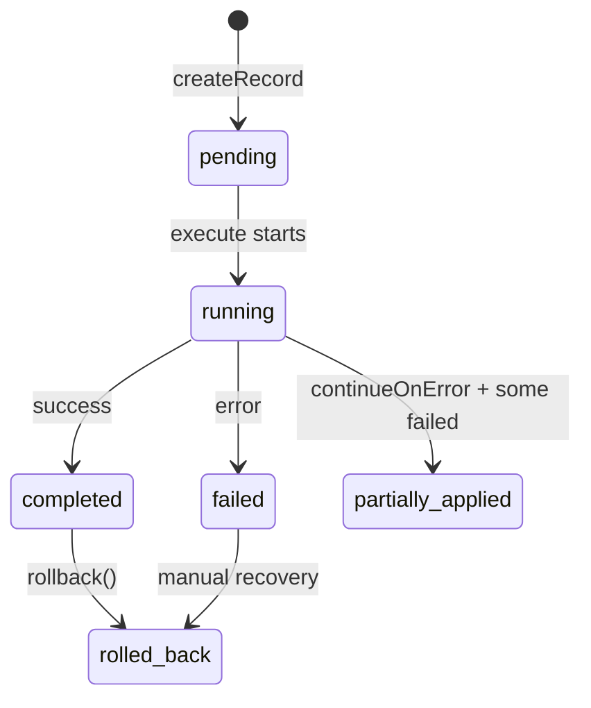

## Risk Engine

### Risk Categories

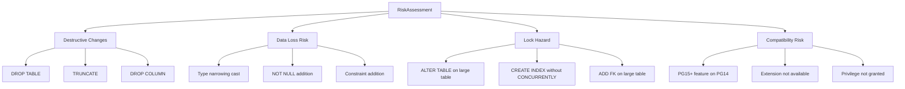

### Risk Level Determination

```javascript
function computeOverallRisk(findings) {
  const severities = findings.map(f => f.severity);
  
  if (severities.some(s => s === 'critical')) return 'critical';
  if (severities.some(s => s === 'high')) return 'high';
  if (severities.some(s => s === 'medium')) return 'medium';
  if (severities.some(s => s === 'low')) return 'low';
  return 'none';
}
```

## Behavioral Migration Architecture

### Execution Order

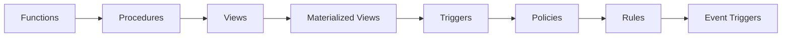

### Dependency Extraction

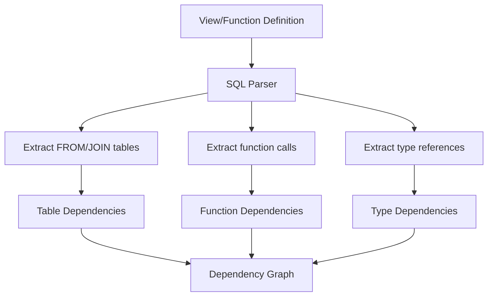

## PostgreSQL Compatibility Layer

### Version Detection

```javascript
async function detectPgVersion(pool) {
  const result = await pool.query("SELECT current_setting('server_version_num')");
  return parseInt(result.rows[0].current_setting);  // e.g., 160001 for PG16.1
}

function majorVersion(version) {
  return Math.floor(version / 10000);  // e.g., 16
}
```

### Feature Detection

```javascript
function supportsPg15Features(pgVersion) {
  return pgVersion >= 150000;
}

function supportsPg16Features(pgVersion) {
  return pgVersion >= 160000;
}

// NULLS NOT DISTINCT (PG15+)
if (constraint.nullsNotDistinct && pgVersion >= 150000) {
  sql += ' NULLS NOT DISTINCT';
}

// ALTER TYPE RENAME VALUE (PG16+)
if (change.property === 'enumValueRename' && pgVersion < 160000) {
  throw new VersionIncompatibilityError('ALTER TYPE RENAME VALUE requires PG16+');
}
```

## Internal Data Structures

### SchemaSnapshot

```typescript
interface SchemaSnapshot {
  version: { numeric: number; major: number; string: string };
  database: DatabaseInfo;
  schemas: { [schemaName: string]: SchemaInfo };
  tables: { [key: string]: TableInfo };
  columns: { [key: string]: ColumnInfo[] };
  constraints: { [key: string]: ConstraintInfo };
  indexes: { [key: string]: IndexInfo };
  functions: { [key: string]: FunctionInfo };
  triggers: { [key: string]: TriggerInfo };
  views: { [key: string]: ViewInfo };
  materializedViews: { [key: string]: MaterializedViewInfo };
  sequences: { [key: string]: SequenceInfo };
  policies: { [key: string]: PolicyInfo };
  rules: { [key: string]: RuleInfo };
  // ... 20+ more object type collections
  checksum: string;
  introspectedAt: string;
}
```

### SchemaChange

```typescript
interface SchemaChange {
  id: string;                    // change_xxxxxxxx
  type: string;                  // addTable, alterColumn, dropIndex, etc.
  changeType: 'CREATE' | 'ALTER' | 'DROP' | 'RENAME';
  objectType: string;            // table, column, index, constraint, etc.
  objectKey: string;             // schema.tablename.columnname
  schema?: string;
  name?: string;
  property?: string;             // For ALTER: the property being changed
  before?: any;                  // Current value
  after?: any;                   // Desired value
  currentValue?: any;
  desiredValue?: any;
  track: 1 | 2;                  // 1=structural, 2=behavioral
  phase: number;                 // 1-32
  ddlStrategy: string;
  dependencies: string[];
  dependents: string[];
  risk: RiskInfo;
  isNonTransactional?: boolean;
  pgVersionMinimum?: number;
  sql?: string;
}
```

### MigrationStep

```typescript
interface MigrationStep {
  id: string;                    // step_001, step_002, ...
  type: StepType;
  phase: number;
  description: string;
  sql: string;
  isTransactional: boolean;
  riskLevel: RiskLevel;
  dependencies: string[];
  changeId?: string;
  preCheck?: string;
  preCheckExpectEmpty?: boolean;
  recoverySql?: string;
}
```

## Design Patterns Used

### 1. Strategy Pattern
The DDL generator uses different strategies for CREATE, ALTER, DROP, RENAME operations.

### 2. Template Method Pattern
`MigrationExecutor.execute()` defines the skeleton algorithm, with hooks for customization.

### 3. Chain of Responsibility
Risk checkers chain their assessments: `checkDestructive → checkDataLoss → checkLockRisk → checkCompatibility`.

### 4. Observer Pattern
`ProgressTracker` allows subscribers to receive execution events.

### 5. Builder Pattern
`MigrationPlan` is built incrementally by the `MigrationPlanner`.

### 6. Facade Pattern
`SwMigrationEngine` provides a simplified interface to the complex subsystem.

## Extension Points

### Custom Risk Category

```javascript
import { RiskEngine } from './risk-engine.js';

class ExtendedRiskEngine extends RiskEngine {
  assess(changes, pgVersion) {
    const findings = super.assess(changes, pgVersion);
    
    // Add custom risk check
    for (const change of changes) {
      if (this.isCustomRisk(change)) {
        findings.push({
          category: 'custom_category',
          severity: 'medium',
          changeId: change.id,
          message: 'Custom risk detected',
          recommendation: 'Review manually',
        });
      }
    }
    
    return computeOverallRisk(findings);
  }
}
```

### Custom Safe Pattern

Add to `safe-patterns.js`:

```javascript
export function generateSafePatterns(change) {
  // ... existing patterns ...
  
  if (change.objectType === 'table' && change.changeType === 'ALTER' && change.property === 'accessMethod') {
    return [
      { sql: `-- Safe tablespace migration...` },
      // Multi-step safe workflow
    ];
  }
  
  return null;
}
```

### Custom Introspection Query

Add to `introspection/queries/`:

```javascript
export async function queryCustomObjects(pool, version) {
  const result = await pool.query(`
    SELECT ...
    FROM pg_catalog.pg_custom
    WHERE ...
  `);
  return result.rows;
}
```

## Important Implementation Notes

### 1. ES Modules
All imports must include `.js` extension:
```javascript
import { foo } from './bar.js';  // Correct
import { foo } from './bar';     // Error in Node.js ESM
```

### 2. Error Handling
All errors extend `MigrationError` and include `toJSON()` for serialization.

### 3. Connection Scoping
`connectionId` is required for multi-database environments. It flows through all components.

### 4. Non-Transactional Detection
`isNonTransactionalSQL()` checks for:
- `CREATE/DROP/REINDEX INDEX CONCURRENTLY`
- `ALTER TYPE ADD VALUE` (pre-PG15)
- `VACUUM`
- `CLUSTER`

### 5. Statement Splitting
`splitSqlStatements()` handles:
- Dollar-quoted strings (`$$body$$`)
- Single-quoted strings with escapes
- Comments (`--` and `/* */`)
- Statement delimiters (`;`)

### 6. Naming Conventions
- Change IDs: `change_xxxxxxxx` (8-char UUID)
- Step IDs: `step_001`, `step_002`, ...
- Savepoints: `sp_step_001`, `sp_step_001_stmt_0`
